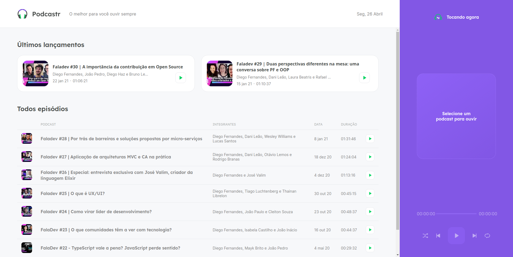
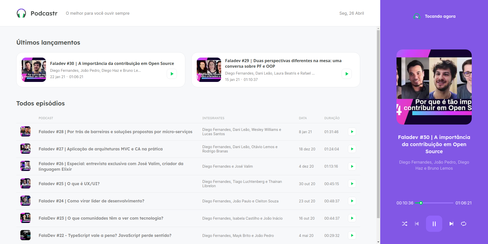
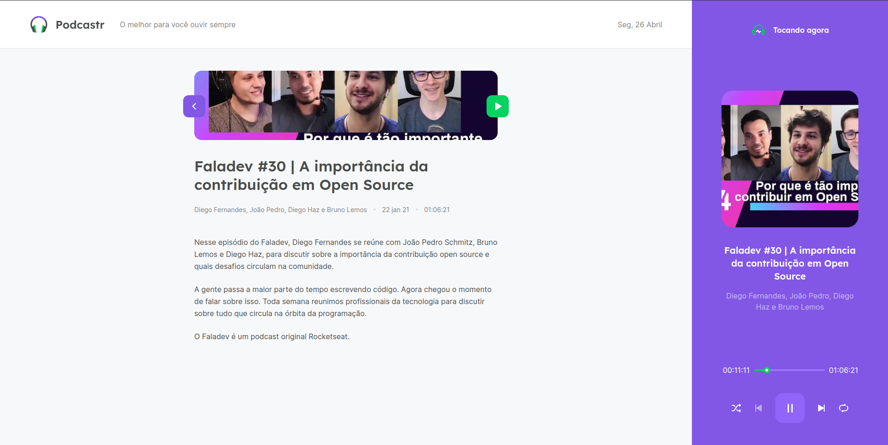
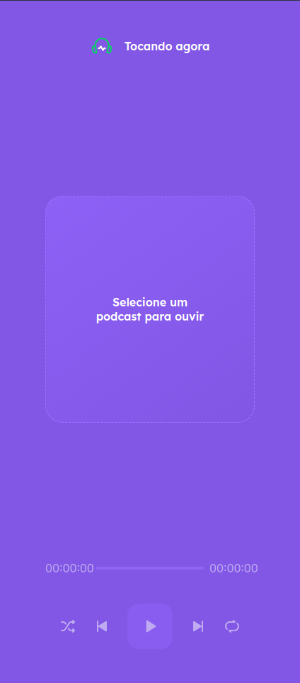
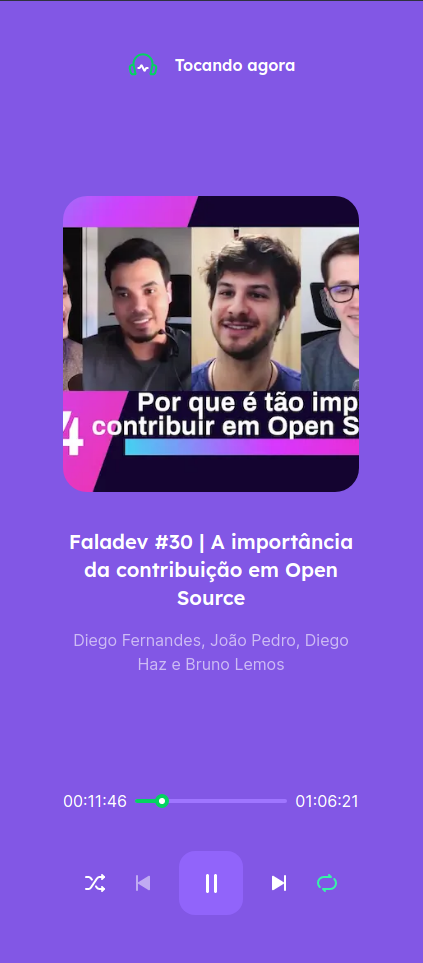
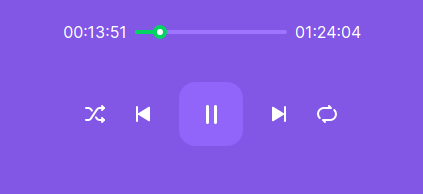

<br />

<p align="center">
  
</p>

<h1 align="center" style="text-align: center;">Podcastr</h1>

<p align="center">
	<a href="https://github.com/joaozandona">
		
	</a>
	<a href="#">
		
	</a>
	<a href="#">
		
	</a>
</p>

<p align="center">
	<br /><b>Podcast system!</b><br />
  A project developed during NLW5.
  <br />
	<span>Frontend of a podcast playback system.</span><br />
	<sub>To the moon! 🚀</sub>
</p>

<br />

<p align="center">
	<b>Home screen</b><br />
  
  <b>Home screen playing a podcast</b><br />
	
  <b>Podcast screen</b><br />
	
  <b>Empty player&nbsp&nbsp&nbsp&nbsp&nbsp&nbsp&nbsp&nbsp&nbsp&nbsp&nbsp&nbsp&nbsp&nbsp&nbsp&nbsp&nbsp&nbsp&nbsp&nbsp&nbsp&nbsp&nbsp&nbsp&nbsp&nbsp&nbsp&nbsp&nbsp&nbsp&nbsp&nbsp&nbsp&nbsp&nbsp&nbsp&nbsp&nbsp Player tocando</b><br />
	
  <br />
	<b>Podcast screen</b><br />
  
</p>

<br />

# :pushpin: Contents

- [Features](#rocket-features)
- [Installation](#wrench-installation)
- [Getting started](#bulb-getting-started)
# :rocket: Features

### Web

- List of episodes
- Separates the last two episodes released
- Each episode has its own page with more information about it

### Player

- All functions of the player / buttons work
- Functional Slider

# :wrench: Installation

### Required :warning:
- Yarn
- Node.js

### SSH

SSH URLs provide access to a Git repository via SSH, a secure protocol. If you have an SSH key registered in your GitHub account, clone the project using this command:

```git clone git@github.com:joaozandona/nlw5-react-next-podcastr.git```

### HTTPS

In case you don't have an SSH key on your GitHub account, you can clone the project using the HTTPS URL, run this command:

```git clone https://github.com/joaozandona/nlw5-react-next-podcastr.git```

# :bulb: Getting started

### Web

1. Open the **web** folder an run ```yarn``` to install the dependencies;
2. This app use a fake api. In the project folder, run ```yarn server```;
3. Run ```yarn dev``` to open the web application on port 3000.


